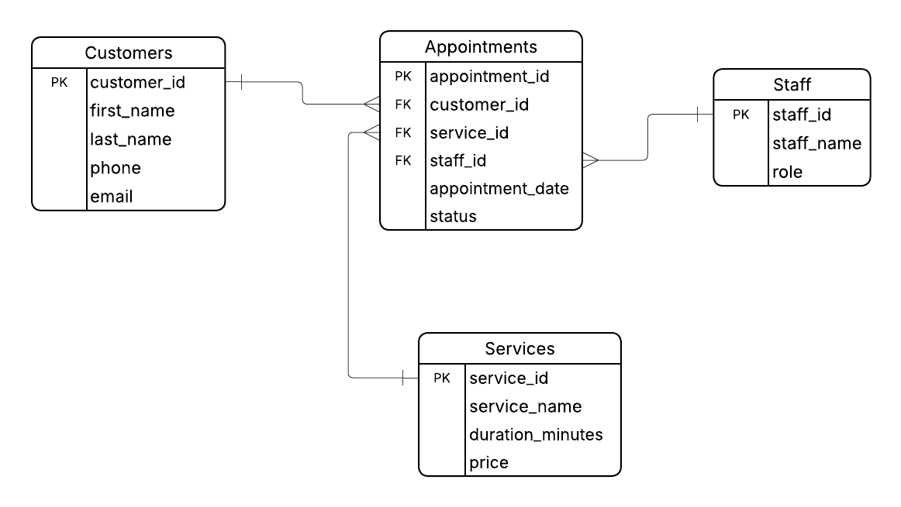

# Appointment Booking Database Project (ERD + SQL)
## Key Results

- Designed a relational database using an Entity Relationship Diagram (ERD) to model business operations
- Implemented a multi-table schema in SQL with primary and foreign key relationships
- Analyzed customer activity, service demand, and staff workload using JOINs and aggregations
- Calculated revenue and booking trends to support business decision-making

## Project Overview

This project demonstrates how to design and implement a small relational database for an appointment-based business.

The workflow covers the full process:

* Designing an **Entity Relationship Diagram (ERD)** in Lucidchart
* Creating the database schema in MySQL
* Loading structured data using CSV files
* Writing SQL queries to answer real business questions

This project is designed as both:

* A **portfolio project**
* A **beginner-friendly SQL tutorial**

---

## Tools Used

* **MySQL** – database creation and querying
* **Lucidchart** – ERD (data model) design
* **Excel / CSV files** – data creation and import
* **GitHub** – project documentation and version control

---

## Business Scenario

A small service-based business needs a system to track:

* Customers
* Services offered
* Staff members
* Appointments

The goal is to organize data efficiently and enable insights such as:

* Customer activity
* Service popularity
* Staff workload
* Revenue tracking

---

## Data Model (ERD)



The database consists of 4 main tables:

### Customers

Stores customer information

* customer_id (PK)
* first_name
* last_name
* phone
* email

### Services

Stores available services

* service_id (PK)
* service_name
* duration_minutes
* price

### Staff

Stores staff members

* staff_id (PK)
* staff_name
* role

### Appointments

Central table connecting all entities

* appointment_id (PK)
* customer_id (FK)
* service_id (FK)
* staff_id (FK)
* appointment_date
* status

---

## 🔗 Relationships

* One customer → many appointments
* One service → many appointments
* One staff member → many appointments

The **appointments** table acts as the central link between all entities.

---

## ⚙️ Database Setup

### 1. Create Database

Run the SQL script:

```sql
CREATE DATABASE appointment_project;
USE appointment_project;
```

### 2. Create Tables

All table creation logic is included in:

```
appointment_project.sql
```

### 3. Load Data

You can load data in two ways:

#### Option A: Import CSV files (recommended for beginners)

* Right-click table in MySQL Workbench
* Select **Table Data Import Wizard**
* Import each CSV file

**Important order:**

1. customers
2. services
3. staff
4. appointments

#### Option B: Use INSERT statements

Also included in the SQL file.

---

## Project Files

```
appointment_project.sql
customers.csv
services.csv
staff.csv
appointments.csv
ERD_appointment_project.png
README.md
```

---

## Key SQL Concepts Demonstrated

* CREATE DATABASE / CREATE TABLE
* Primary Keys and Foreign Keys
* Data types (INT, VARCHAR, DECIMAL, DATETIME)
* INNER JOIN and LEFT JOIN
* GROUP BY and aggregation
* COUNT(), SUM(), ROUND()
* Filtering with WHERE
* Date extraction

---

## 📊 Business Questions Answered

### 1. How many appointments has each customer booked?

Identifies repeat customers and engagement.

### 2. Which services are booked most often?

Highlights demand for services.

### 3. Which staff member handled the most appointments?

Shows workload distribution.

### 4. What is the total revenue from completed appointments?

Measures actual earned revenue.

### 5. What is revenue by service?

Identifies top-performing services.

### 6. Which days have the most bookings?

Shows trends in appointment volume.

---

## Key Insights (Example)

* Some customers book multiple appointments → repeat business
* Certain services generate higher revenue despite fewer bookings
* Staff workload may not be evenly distributed
* Revenue should only include completed appointments

---

## Skills Demonstrated

* Data modeling using ERD
* Translating business requirements into database design
* Building relational schemas
* Working with structured data
* Writing analytical SQL queries
* Connecting technical work to business insights

---

## How to Explain This Project (Interview Version)

"I designed a relational database for an appointment-based business by first creating an ERD in Lucidchart to define the structure and relationships. I then implemented the schema in MySQL, loaded sample data, and wrote SQL queries to analyze customer activity, service demand, staff workload, and revenue."

---

## Future Improvements

* Add more data for deeper analysis
* Create dashboards in Power BI or Tableau
* Add indexes for performance optimization
* Introduce additional tables (payments, locations, reviews)
* Build an automated pipeline using Airtable or Make

---

## Learning Value

This project is ideal for:

* Beginner SQL learners
* Aspiring data analysts
* Anyone learning database design

It shows how **data modeling and SQL work together** to solve real business problems.
