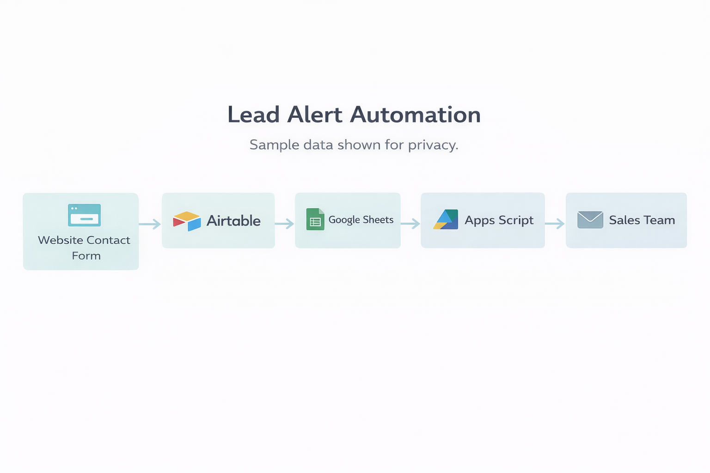
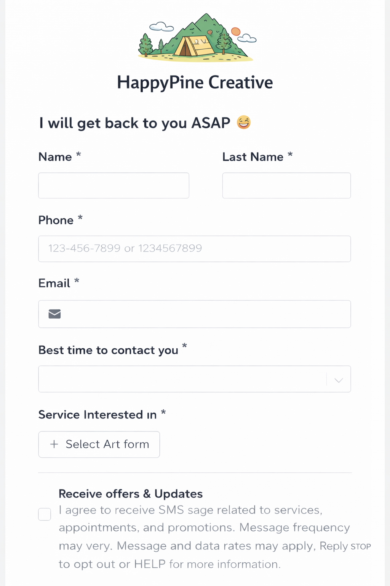
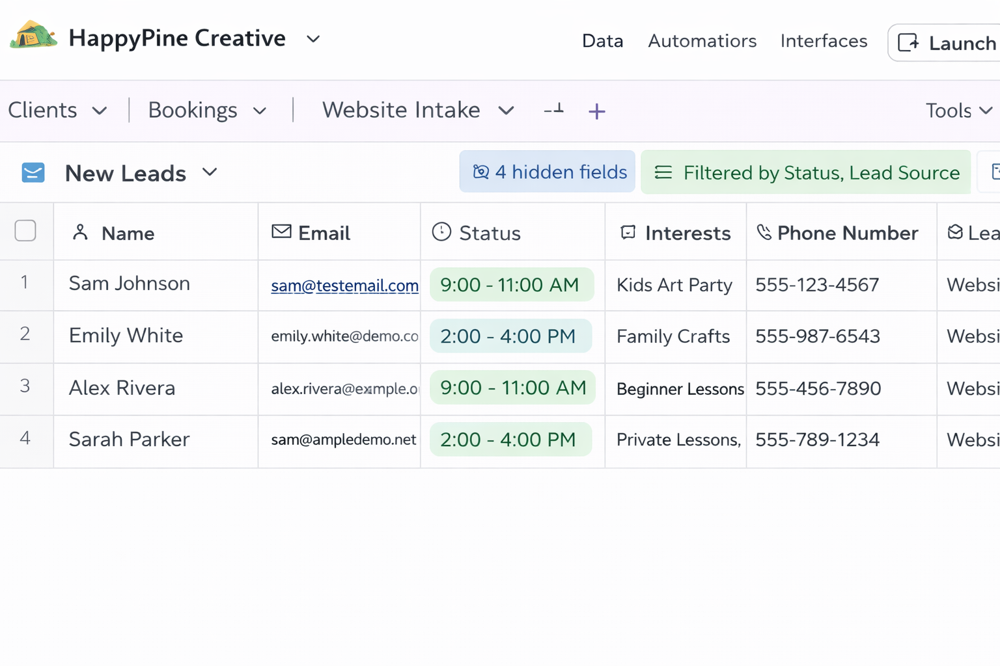
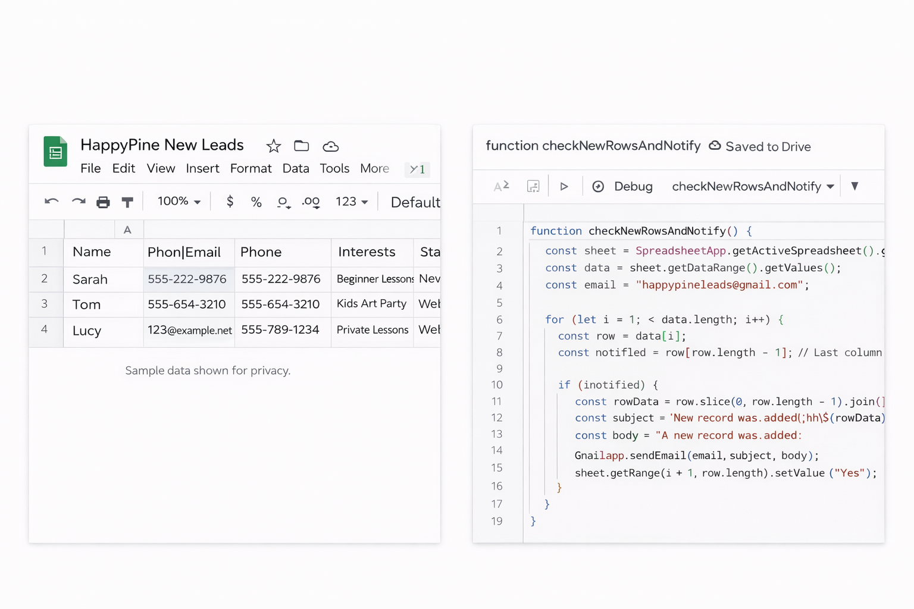

# Low-Budget Lead Alert Automation Use Case

## Project Overview

This project demonstrates how a small business can use affordable and accessible tools to notify the sales team when a new lead submits a website contact form.

Instead of purchasing expensive CRM software, the business implemented a practical workflow using:

- Website Contact Form  
- Airtable  
- Google Sheets  
- Google Apps Script  
- Email Notifications

The solution improves response speed, sales visibility, and lead handling while keeping costs low.

---

# Business Problem

The business needed a simple and budget-friendly way to alert the sales team whenever a new website lead was received.

The previous manual process created several issues:

- slow response times  
- missed opportunities  
- poor visibility into new leads  
- inconsistent follow-up  
- unnecessary manual checking

---

# My Role

**Business Analyst**

I analyzed the workflow and documented:

- Use Case  
- Basic Flow  
- Alternate Flows  
- Exception Flows  
- Business Rules  
- Functional Requirements  
- Acceptance Criteria

---

# Systems Used

- Website Contact Form  
- Airtable  
- Google Sheets  
- Google Apps Script  
- Gmail / Email

---

# Process Summary

1. Customer completes website contact form  
2. Lead is stored in Airtable  
3. Airtable automation adds lead to Google Sheets  
4. Apps Script checks for new rows  
5. Sales team receives email alert  
6. Row is marked as notified

---

# Workflow Diagram

---

# Screenshots

## Website Contact Form

## Airtable Lead Database

## Google Sheet + Apps Script

---

# Use Case

## UC-1: Notify Sales Team of New Website Lead

### Description

This use case describes how the system captures a website lead and sends an email alert to the sales team using low-cost automation tools.

---

## Actors

### Primary Actor
Prospective Customer

### Secondary Actor
Sales Team

### Supporting Systems
Website Form  
Airtable  
Google Sheets  
Google Apps Script  
Email System

---

## Preconditions

- Website form is active  
- Airtable is connected  
- Google Sheet is available  
- Apps Script is active  
- Sales email is configured

---

## Trigger

Customer submits the website contact form.

---

## Postconditions

- Lead exists in Airtable  
- Lead exists in Google Sheets  
- Sales receives email alert  
- Lead row is marked as notified

---

# Basic Flow (BF)

| Step ID | Actor | Action |
|---|---|---|
| BF-1 | Customer | Customer completes and submits contact form |
| BF-2 | System | Lead data is stored in Airtable |
| BF-3 | System | Airtable automation creates a new row in Google Sheets |
| BF-4 | System | Apps Script checks for unnotified rows |
| BF-5 | System | Apps Script sends email alert to sales |
| BF-6 | System | Row is marked as notified |
| BF-7 | System | Workflow ends successfully |

---

# Alternate Flows (AF)

## AF-1 No New Leads Found (from BF-4)

| Step ID | Actor | Action |
|---|---|---|
| AF-1.1 | System | No unnotified rows are found |
| AF-1.2 | System | No email is sent |
| AF-1.3 |  | End alternate flow |

---

## AF-2 Multiple New Leads Found (from BF-4)

| Step ID | Actor | Action |
|---|---|---|
| AF-2.1 | System | Multiple unnotified rows are found |
| AF-2.2 | System | Each row is processed one by one |
| AF-2.3 | System | Emails are sent and rows marked as notified |
| AF-2.4 |  | Return to BF-7 |

---

# Exception Flows (EF)

## EF-1 Email Notification Failure (from BF-5)

| Step ID | Actor | Action |
|---|---|---|
| EF-1.1 | System | Email fails to send |
| EF-1.2 | System | Lead remains pending for retry or manual review |
| EF-1.3 |  | End exception flow |

---

## EF-2 Row Update Failure (from BF-6)

| Step ID | Actor | Action |
|---|---|---|
| EF-2.1 | System | Email sent but row not marked as notified |
| EF-2.2 | System | Duplicate alert risk exists on next run |
| EF-2.3 |  | End exception flow |

---

# Business Rules

| Rule ID | Rule | Description |
|---|---|---|
| BR-1 | New Lead Required | Only new form submissions enter the process |
| BR-2 | Unnotified Only | Only rows not marked as notified trigger alerts |
| BR-3 | Mark After Send | Row must be marked as notified after successful email |
| BR-4 | Sales Visibility | Sales must receive alerts for new leads |

---

# Functional Requirements

| FR ID | Requirement |
|---|---|
| FR-1 | System shall capture website form submissions |
| FR-2 | System shall store leads in Airtable |
| FR-3 | System shall copy leads to Google Sheets |
| FR-4 | System shall detect unnotified rows |
| FR-5 | System shall send email alerts |
| FR-6 | System shall mark processed rows as notified |

---

# Acceptance Criteria

| AC ID | Criteria |
|---|---|
| AC-1 | New form creates Airtable lead |
| AC-2 | Lead appears in Google Sheet |
| AC-3 | Sales receives email alert |
| AC-4 | Row is marked notified |
| AC-5 | Notified rows do not resend |

---

# Skills Demonstrated

- Business Analysis  
- Use Cases  
- Workflow Documentation  
- Process Improvement  
- Low-Code Automation  
- Requirements Gathering  
- Stakeholder Thinking

---

# Resume Bullet

Created business requirements and use case documentation for a low-budget lead alert automation using Airtable, Google Sheets, and Apps Script to improve sales visibility and response speed.

---

# Annex: Understanding Use Case Flow Types

## BF = Basic Flow
The normal successful path.

Example: lead submitted → email sent → row marked.

## AF = Alternate Flow
A valid variation of the process.

Example: no new leads found.

## EF = Exception Flow
An error or failure that prevents normal processing.

Example: email fails to send.

## Preconditions
What must already be true before the process starts.

Example: Apps Script is active.

## Trigger
What starts the process.

Example: customer submits form.

## Postconditions
What should be true after the process ends.

Example: sales received alert.

## Business Rules
Policies or logic the system must follow.

Example: only unnotified rows trigger alerts.

## Functional Requirements
What the system must do.

Example: send email alert.

## Acceptance Criteria
How we confirm the solution works.

Example: row is marked after email send.
