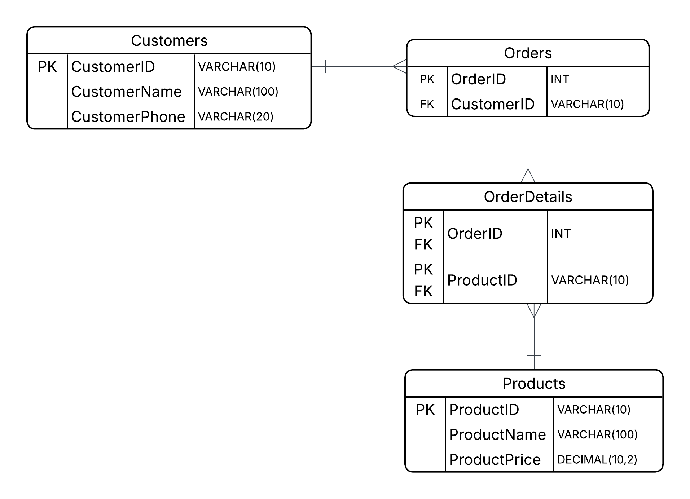

# Data Normalization Tutorial: From UNF to 3NF

---

## Introduction

Databases often start with messy or unstructured data, which can be difficult to manage, query, and maintain. **Data normalization** is a process used to organize data into clean, structured tables while minimizing redundancy and ensuring data integrity.  

This tutorial demonstrates how a dataset moves through:

- **UNF (Unnormalized Form)**  
- **1NF (First Normal Form)**  
- **2NF (Second Normal Form)**  
- **3NF (Third Normal Form)**  

You will learn **why each step is necessary** and how the data is transformed into a well-structured relational model.

---

## Real-World Scenario

A small business tracks customer orders in a spreadsheet.

Here’s the messy data:

| OrderID | CustomerName | CustomerPhone | ProductsOrdered              | ProductPrices     |
|--------|--------------|---------------|------------------------------|-------------------|
| 1001   | John Smith   | 111-222-3333  | Laptop, Mouse                | 1200, 25          |
| 1002   | Emily Davis  | 777-888-9999  | Phone                        | 800               |
| 1003   | Jack Lee     | 333-444-5555  | Laptop, Monitor, Keyboard    | 1200, 300, 100    |

---

## Step 0: UNF (Unnormalized Form)

This data is in **Unnormalized Form (UNF)**.

### Problems

- Multiple values in one column → repeating groups(1)  
- Fields are not atomic → atomic values violation(2)  
- Customer data is repeated → redundancy(3)  
- Difficult to query and maintain  

---

## Step 1: Convert to 1NF

### Goal

Ensure all fields contain **atomic values(2)**.  
Each row represents a single product in an order.

### 1NF Table

| OrderID | CustomerName | CustomerPhone | ProductName | ProductPrice |
|--------|--------------|---------------|-------------|--------------|
| 1001   | John Smith   | 111-222-3333  | Laptop      | 1200         |
| 1001   | John Smith   | 111-222-3333  | Mouse       | 25           |
| 1002   | Emily Davis  | 777-888-9999  | Phone       | 800          |
| 1003   | Jack Lee     | 333-444-5555  | Laptop      | 1200         |
| 1003   | Jack Lee     | 333-444-5555  | Monitor     | 300          |
| 1003   | Jack Lee     | 333-444-5555  | Keyboard    | 100          |

---

## Step 2: Convert to 2NF

### Goal

Remove partial dependencies(4).  
Customer data should not repeat for every product row.

### 2NF Tables

#### Customers

| CustomerID | CustomerName | CustomerPhone |
|-----------|--------------|---------------|
| C1        | John Smith   | 111-222-3333  |
| C2        | Emily Davis  | 777-888-9999  |
| C3        | Jack Lee     | 333-444-5555  |

#### Orders

| OrderID | CustomerID |
|--------|------------|
| 1001   | C1         |
| 1002   | C2         |
| 1003   | C3         |

#### OrderDetails

| OrderID | ProductName | ProductPrice |
|--------|-------------|--------------|
| 1001   | Laptop      | 1200         |
| 1001   | Mouse       | 25           |
| 1002   | Phone       | 800          |
| 1003   | Laptop      | 1200         |
| 1003   | Monitor     | 300          |
| 1003   | Keyboard    | 100          |

---

## Step 3: Convert to 3NF

### Goal

Remove transitive dependencies(5). Each table should represent a single entity and eliminate redundancy.

### Customers

| CustomerID | CustomerName | CustomerPhone |
|-----------|--------------|---------------|
| C1        | John Smith   | 111-222-3333  |
| C2        | Emily Davis  | 777-888-9999  |
| C3        | Jack Lee     | 333-444-5555  |

### Orders

| OrderID | CustomerID |
|--------|------------|
| 1001   | C1         |
| 1002   | C2         |
| 1003   | C3         |

### Products

| ProductID | ProductName | ProductPrice |
|----------|-------------|--------------|
| P1       | Laptop      | 1200         |
| P2       | Mouse       | 25           |
| P3       | Phone       | 800          |
| P4       | Monitor     | 300          |
| P5       | Keyboard    | 100          |

### OrderDetails

| OrderID | ProductID |
|--------|-----------|
| 1001   | P1        |
| 1001   | P2        |
| 1002   | P3        |
| 1003   | P1        |
| 1003   | P4        |
| 1003   | P5        |

**Explanation:**  
`OrderDetails` is a junction table connecting `Orders` and `Products`.  
- `OrderID` is both a **Primary Key (PK)** and a **Foreign Key (FK)** referencing `Orders`.  
- `ProductID` is both a **PK** and **FK** referencing `Products`.  
- The **composite PK** (`OrderID + ProductID`) ensures that each product appears **at most once per order**, while maintaining referential integrity to both parent tables.

### ERD Diagram

The ERD (Entity-Relationship Diagram) visually represents the fully normalized 3NF database structure.  
It shows how each table is related, highlights the primary and foreign keys, and makes it easier to understand the relationships and flow of data.  



---

## Optional: Rebuilding Normalized View

Before denormalizing, we can examine the normalized data directly:

```sql
SELECT
    o.OrderID,
    c.CustomerName,
    p.ProductName,
    p.ProductPrice
FROM orders o
JOIN customers c ON o.CustomerID = c.CustomerID
JOIN order_details od ON o.OrderID = od.OrderID
JOIN products p ON od.ProductID = p.ProductID;
```
## Optional: Rebuilding Original View

Although the database is normalized, we can recreate the original “spreadsheet-style” view using SQL:

```sql
SELECT
    o.OrderID,
    c.CustomerName,
    GROUP_CONCAT(p.ProductName) AS Products,
    GROUP_CONCAT(p.ProductPrice) AS Prices
FROM orders o
JOIN customers c ON o.CustomerID = c.CustomerID
JOIN order_details od ON o.OrderID = od.OrderID
JOIN products p ON od.ProductID = p.ProductID
GROUP BY o.OrderID, c.CustomerName;
```

## Glossary

1. **Repeating Groups** – Multiple values stored in a single column.  
2. **Atomic Values** – Each field stores a single, indivisible value.  
3. **Redundancy** – Duplicate data stored unnecessarily in a database.  
4. **Partial Dependency** – A non-key attribute depends on only part of a composite primary key.  
5. **Transitive Dependency** – A non-key attribute depends on another non-key attribute instead of depending directly on the primary key.
