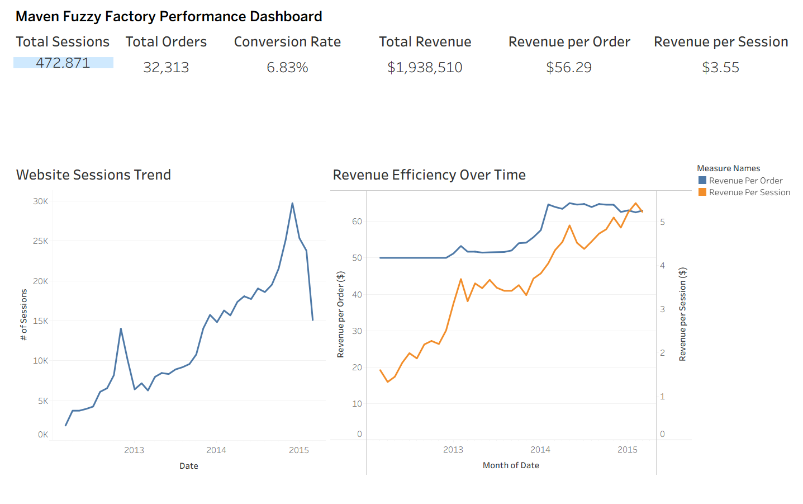
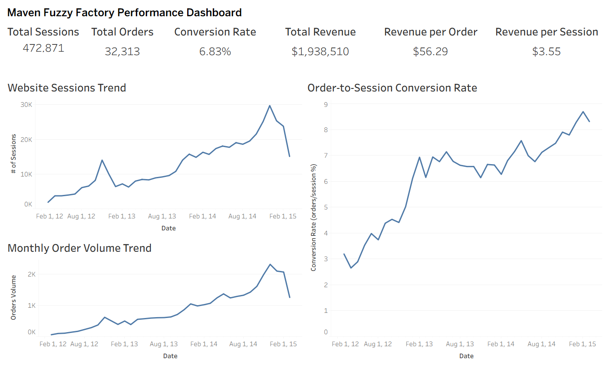
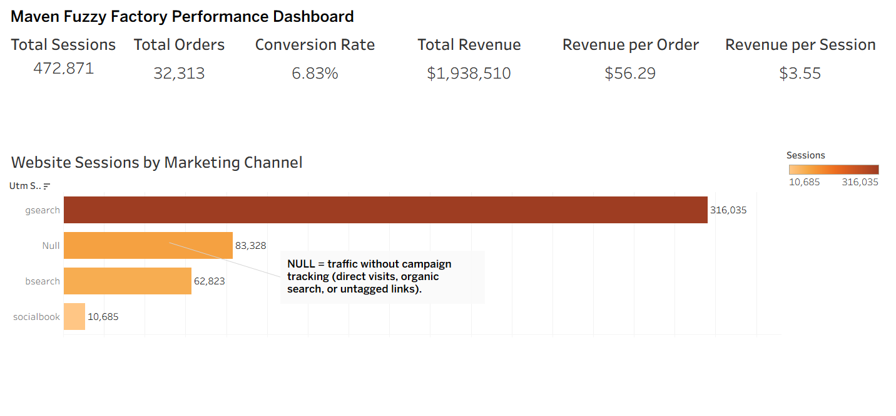

# Maven Fuzzy Factory — Ecommerce Performance Analysis

## Key Result

Over a three-year period, Maven Fuzzy Factory achieved significant growth:

- Traffic increased by 15x
- Conversion rate improved from 3% to 9%
- Revenue per visitor increased from $1.5 to $5+

This demonstrates strong performance driven by both **customer acquisition and improved monetization efficiency**.

---

## Key Performance Indicators

The following KPIs summarize overall business performance during the analysis period:

- **Total Sessions:** ~470K  
- **Total Orders:** ~32K  
- **Conversion Rate:** ~6.8%  
- **Total Revenue:** ~$1.9M  
- **Revenue per Order (AOV):** ~$56  
- **Revenue per Session:** ~$3.5  

These metrics provide a consolidated view of traffic, conversion efficiency, and monetization performance.

---

## Tableau Dashboards

### 1️⃣ Executive Overview & Revenue Efficiency

🔗 **Live Dashboard:**  
https://public.tableau.com/views/Toy_store/ToyStore1

📸 **Preview:**  


**What it shows:**
- Core KPIs (Sessions, Orders, Conversion Rate, Revenue)
- Revenue per Order vs Revenue per Session (dual-axis)
- Website sessions growth trend
- Overall monetization performance over time

---

### 2️⃣ Traffic, Orders & Conversion Trends

🔗 **Live Dashboard:**  
https://public.tableau.com/views/Toy_store_2/ToyStore2

📸 **Preview:**  


**What it shows:**
- Website sessions trend over time
- Monthly order volume growth
- Conversion rate improvement trend
- Relationship between traffic and order growth

---

### 3️⃣ Marketing Channel Performance

🔗 **Live Dashboard:**  
https://public.tableau.com/views/Toy_store_3/ToyStore3

📸 **Preview:**  


**What it shows:**
- Sessions by marketing channel
- Channel contribution comparison
- Identification of top-performing acquisition sources
- Insight into unattributed traffic (NULL = direct/organic/untracked)

---

## Project Overview

This project analyzes the **Maven Fuzzy Factory ecommerce dataset** to understand how the business has grown over time and what factors drive revenue performance.

The analysis focuses on the relationship between:

- Website traffic
- Customer conversions
- Marketing channels
- Revenue generation
- Monetization efficiency

The goal is to identify **key trends in website performance and ecommerce revenue drivers** over a three-year period.

---

## Dataset Overview

The dataset contains approximately **three years of ecommerce activity (March 2012 – March 2015)**.

The database includes the following core tables:

| Table | Description |
|------|-------------|
| website_sessions | Records of website visits |
| website_pageviews | Individual pageviews within sessions |
| orders | Completed purchases |
| order_items | Products purchased within each order |
| order_item_refunds | Refunded items |
| products | Product catalog |

---

## Data Model

The tables are connected through the following relationships:

```
website_sessions
│
│ website_session_id
▼
orders
│
│ order_id
▼
order_items
```

Key identifiers:

- **website_session_id** → unique visitor session  
- **order_id** → purchase transaction  
- **order_item_id** → individual product within an order  

Revenue data can appear in two places:

| Field | Meaning |
|------|---------|
| orders.price_usd | Total order value |
| order_items.price_usd | Individual product price |

For this project, **item-level revenue (`order_items.price_usd`) is used** to allow deeper product-level analysis.

---

## Key Business Questions

The analysis answers the following questions:

1. What is the overall **traffic trend**?  
2. How has **order volume** changed over time?  
3. What percentage of sessions convert into purchases?  
4. Which **marketing channels** drive the most traffic?  
5. How much revenue does each order generate?  
6. How much revenue does each visitor generate?  

---

## Analysis Steps

### 1. Data Coverage Validation

```sql
SELECT
MIN(created_at) AS first_session,
MAX(created_at) AS last_session
FROM website_sessions;

SELECT
MIN(created_at) AS first_order,
MAX(created_at) AS last_order
FROM orders;
```

**Result:**  
The dataset spans approximately **March 2012 – March 2015**.

---

### 2. Table Validation

```sql
SELECT 'website_sessions', COUNT(*) FROM website_sessions
UNION ALL
SELECT 'website_pageviews', COUNT(*) FROM website_pageviews
UNION ALL
SELECT 'orders', COUNT(*) FROM orders
UNION ALL
SELECT 'order_items', COUNT(*) FROM order_items
UNION ALL
SELECT 'order_item_refunds', COUNT(*) FROM order_item_refunds
UNION ALL
SELECT 'products', COUNT(*) FROM products;
```

This confirms the dataset contains **complete ecommerce records**.

---

## Website Traffic Trend

```sql
SELECT
YEAR(created_at) AS year,
MONTH(created_at) AS month,
COUNT(DISTINCT website_session_id) AS sessions
FROM website_sessions
GROUP BY YEAR(created_at), MONTH(created_at)
ORDER BY year, month;
```

### Insight

Website traffic increased dramatically over time, growing from a few thousand monthly sessions to more than **25,000 sessions per month** by the end of the dataset.

This indicates strong growth in **customer acquisition**.

---

## Order Volume Trend

```sql
SELECT
YEAR(created_at) AS year,
MONTH(created_at) AS month,
COUNT(DISTINCT order_id) AS orders
FROM orders
GROUP BY YEAR(created_at), MONTH(created_at)
ORDER BY year, month;
```

### Insight

Order volume increased alongside traffic, confirming **growing customer demand**.

However, order growth alone does not reveal whether the website is becoming more effective at converting visitors.

---

## Conversion Rate

```sql
SELECT
YEAR(ws.created_at) AS year,
MONTH(ws.created_at) AS month,
COUNT(DISTINCT ws.website_session_id) AS sessions,
COUNT(DISTINCT o.order_id) AS orders,
ROUND(
COUNT(DISTINCT o.order_id) /
NULLIF(COUNT(DISTINCT ws.website_session_id),0) * 100,
2
) AS conversion_rate
FROM website_sessions ws
LEFT JOIN orders o
ON ws.website_session_id = o.website_session_id
GROUP BY YEAR(ws.created_at), MONTH(ws.created_at)
ORDER BY year, month;
```

### Insight

Conversion rate improved significantly during the analysis period, indicating that the website became **more effective at converting visitors into customers**.

---

## Marketing Channel Analysis

```sql
SELECT
utm_source,
utm_campaign,
http_referer,
COUNT(DISTINCT website_session_id) AS sessions
FROM website_sessions
GROUP BY utm_source, utm_campaign, http_referer
ORDER BY sessions DESC;
```

### Insight

Paid search marketing (especially Google non-brand campaigns) drove the majority of website traffic.

Other channels contributed significantly less traffic volume, indicating a **strong reliance on search advertising**.

---

## Revenue per Order (Average Order Value)

```sql
SELECT
YEAR(created_at) AS year,
MONTH(created_at) AS month,
COUNT(DISTINCT order_id) AS orders,
SUM(price_usd) AS revenue,
ROUND(
SUM(price_usd) /
NULLIF(COUNT(DISTINCT order_id),0),
2
) AS revenue_per_order
FROM order_items
GROUP BY YEAR(created_at), MONTH(created_at)
ORDER BY year, month;
```

### Insight

Average revenue per order increased gradually over time, suggesting that customers were either:

- purchasing more products per order  
- purchasing higher-value products  

---

## Revenue per Session (Monetization Efficiency)

```sql
SELECT
YEAR(ws.created_at) AS year,
MONTH(ws.created_at) AS month,
COUNT(DISTINCT ws.website_session_id) AS sessions,
SUM(oi.price_usd) AS revenue,
ROUND(
SUM(oi.price_usd) /
NULLIF(COUNT(DISTINCT ws.website_session_id),0),
2
) AS revenue_per_session
FROM website_sessions ws
LEFT JOIN orders o
ON ws.website_session_id = o.website_session_id
LEFT JOIN order_items oi
ON o.order_id = oi.order_id
GROUP BY YEAR(ws.created_at), MONTH(ws.created_at)
ORDER BY year, month;
```

Revenue per session can be interpreted as:

Revenue per Session = Conversion Rate × Revenue per Order

### Insight

Revenue per session increased steadily over time, indicating improvements in both:

- conversion performance  
- customer spending behavior  

This makes it a powerful summary metric for **overall ecommerce performance**.

---

## Strategic Analysis (Putting It All Together)

The business achieved growth through a combination of:

- increasing traffic  
- improving conversion rate  
- increasing revenue per order  

Revenue per session increased significantly, confirming that the business improved its ability to **monetize each visitor**.

This indicates a maturing ecommerce operation with improving efficiency, not just increasing traffic volume.

---

## Business Recommendations

### 1. Diversify marketing channels
Reduce reliance on Google paid search by investing in SEO, email marketing, and social channels.

### 2. Optimize paid search performance
Focus budget on high-converting campaigns and eliminate underperforming keywords.

### 3. Continue conversion optimization
Improve landing pages, product pages, and checkout flow through testing and UX improvements.

### 4. Increase average order value
Introduce bundles, upselling, and free shipping thresholds to encourage larger purchases.

### 5. Improve tracking and attribution
Reduce "undetermined" traffic by improving UTM tagging and campaign tracking.

### 6. Monitor revenue per session as a core KPI
Use this metric to track overall business performance since it combines conversion and revenue.

---

## Key Takeaways

- Website traffic grew substantially over the three-year period  
- Order volume increased alongside traffic  
- Conversion rates improved significantly  
- Average order value increased gradually  
- Revenue per visitor improved consistently  

Overall, the business experienced strong growth driven by **both increased traffic and improved monetization efficiency**.

---

## Tools Used

- MySQL  
- SQL  
- Tableau (Data Visualization)  
- GitHub  

---

## 📂 Project Structure

```
toy_shop/
│
├── README.md                     # Project overview and analysis
├── data/                         # Data loading / preparation files
├── sql/
│   └── exploratory_analysis.sql  # Core SQL analysis queries
├── dashboards/
│   ├── dashboard_1.png           # Executive overview dashboard
│   ├── dashboard_2.png           # Trends & performance dashboard
│   └── dashboard_3.png           # Marketing channel analysis dashboard
```
